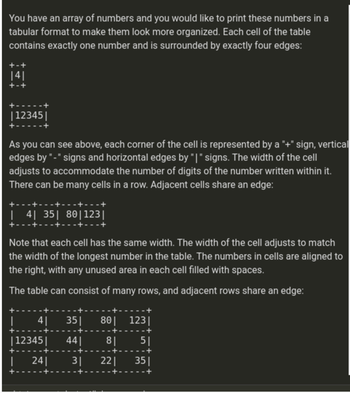

https://www.chegg.com/homework-help/questions-and-answers/array-numbers-would-like-print-numbers-tabular-format-make-look-organized-cell-table-conta-q89239765

You have an array of numbers and you would like to print these numbers in a tabular format to make them look more organized. Each cell of the table contains exactly one number and is surrounded by exactly four edges: +-+ 141 +-+ |12345 +-----+ As you can see above, each corner of the cell is represented by a "+" sign, vertical edges by "-" signs and horizontal edges by "|" signs. The width of the cell adjusts to accommodate the number of digits of the number written within it. There can be many cells in a row. Adjacent cells share an edge: + | 4| 3580|123| +---+ Note that each cell has the same width. The width of the cell adjusts to match the width of the longest number in the table. The numbers in cells are aligned to the right, with any unused area in each cell filled with spaces. The table can consist of many rows, and adjacent rows share an edge: | 41 35 800 1231 |12345 44 8. 51 24| 31 22 35| + ---- PN min 4 solution.java * 1 // you can also use imports, for example: 2 // import java.util.*; 3 // you can write to stderr for debugging purposes, e.g. 5 // System.err.println("this is a debug message"); 6 7 class Solution { 8 public void solution(int[] a, int k) { 9 // write your code in Java SE 8 10 } 111 } 12 000 OHN H